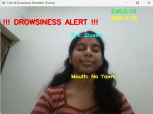
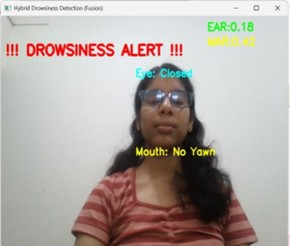
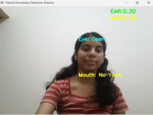
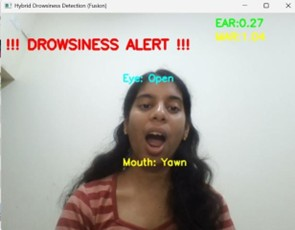
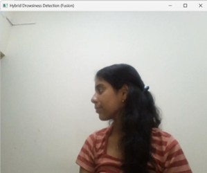

# Driver Drowsiness Detection System 

A **real-time computer vision system** that detects driver fatigue using **eye closure detection and yawn detection**.
The system monitors the driver's face through a webcam and triggers an **audio alert** when signs of drowsiness are detected.

---

## Features 

* CNN-based **eye open/closed detection**
* CNN-based **yawn detection**
* **Hybrid fusion logic** using Eye Aspect Ratio (EAR) + Mouth Aspect Ratio (MAR)
* **Real-time webcam inference**
* **Audio alert system** when drowsiness is detected

---

## Tech Stack 

* **Python**
* **TensorFlow / Keras**
* **OpenCV**
* **dlib**
* **NumPy**

---

## Project Structure 

```
driver-drowsiness-detection/
│
├── src/
│   ├── train_eye_model.py
│   ├── train_yawn_model.py
│   └── detect_drowsiness.py
│
├── haarcascades/
│   ├── haarcascade_frontalface_default.xml
│   └── haarcascade_mcs_mouth.xml
│
│   └── alarm.wav
│
├── notebooks/
│   └── proje1.ipynb
│
├── requirements.txt
├── README.md
└── .gitignore
```

---

## System Pipeline 🧠

```
Camera Frame
      ↓
Face Detection (dlib)
      ↓
Facial Landmark Extraction
      ↓
Feature Extraction (EAR / MAR)
      ↓
CNN Predictions (Eye State & Yawn Detection)
      ↓
Fusion Logic (CNN + EAR/MAR)
      ↓
Temporal Filtering (Consecutive Frame Analysis)
      ↓
Drowsiness Alert + Audio Alarm
```
## Methodology 

The proposed system uses a **hybrid drowsiness detection approach** that combines deep learning with geometric facial analysis.

A **MobileNetV2-based CNN** is trained to classify eye state (open/closed) and yawning.
To improve robustness in real-time conditions, **geometric features — Eye Aspect Ratio (EAR) and Mouth Aspect Ratio (MAR)** are also computed from facial landmarks.

Final drowsiness detection is performed using **fusion logic combined with temporal filtering**, ensuring that alerts are triggered only when fatigue indicators persist across multiple frames.

##Example output

**Descriptions**

* **Eye Detection** – CNN model detects eye closure.
* **Eye + Yawn Detection** – Simultaneous monitoring of eye state and yawning.
* **Yawn Detection Alert** – Yawn detected using CNN + MAR.
* **Drowsiness Alert** – Alert triggered after consecutive frames of drowsiness.
* **Face Not Detected** – System waits until a face is detected.
## Example Output 📷

<p align="center">
  
    
</p>

<p align="center">
  
  
</p>

<p align="center">


</p>

**Descriptions**

* **Face Not Detected** – System waits until a face appears in the frame.
* **Eye Closed Detection** – CNN + EAR detects prolonged eye closure.
* **Eye & Yawn Detection** – Monitoring eye state and yawning simultaneously.
* **Yawn Detection Alert** – MAR + CNN detects yawning.
* **Drowsiness Alert** – Alarm triggered when fatigue indicators persist.


## Dataset 

The dataset used for Eye training is the **MRL Eye Dataset**.

Dataset source:
https://www.kaggle.com/datasets/serenaraju/mrl-eye-dataset
The dataset used for Yawn training is the also from kaggle.
⚠️ Dataset is **not included in this repository** due to GitHub size limits.

---

## Installation 

Clone the repository:

```bash
git clone https://github.com/yourusername/driver-drowsiness-detection.git
cd driver-drowsiness-detection
```

Install dependencies:

```bash
pip install -r requirements.txt
```

---

## Training Models 
Train the eye detection model:

```bash
python src/train_eye_model.py
```

Train the yawn detection model:

```bash
python src/train_yawn_model.py
```

---

## Run Real-Time Detection 

```bash
python src/detect_drowsiness.py
```

The webcam will start and the system will monitor the driver's eyes and mouth.
If drowsiness is detected, an **alarm sound** will be triggered.

---

## Results 📈

| Model                | Accuracy |
| -------------------- | -------- |
| Eye Detection Model  | ~94%     |
| Yawn Detection Model | ~71%     |
| Real-time speed      | ~20 FPS  |

---

## Future Improvements 

* Build a **REST API backend**
* Add **web dashboard for monitoring**
* Improve **low-light performance**
* Optimize for **embedded systems (Raspberry Pi / Jetson Nano)**

---

## Author 👨‍💻

Helinia Sarah
